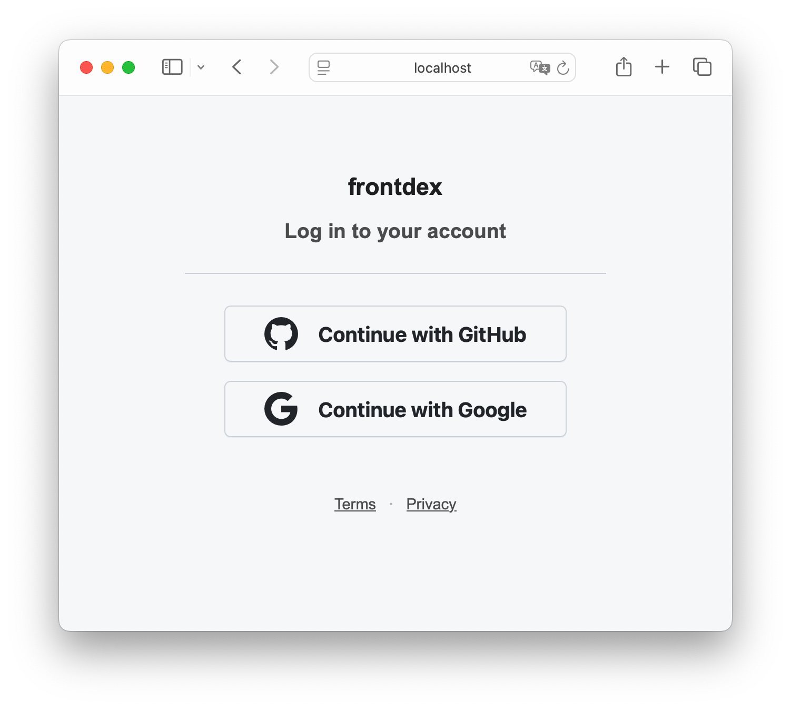

# frontdex Example



## How to run

Start Dex and the example app as follows:

```sh
docker run \
  --name dex \
  -p 5556:5556 \
  -v ./dex.yaml:/etc/dex/config.yaml \
  --rm \
  dexidp/dex:latest \
  dex serve /etc/dex/config.yaml
```

Make sure to update the OAuth2 client IDs and secrets in Dex. The provided `dex.yaml` contains placeholders—replace them with your actual credentials.

Run the example app:

```sh
go run main.go
```

Finally, open `http://localhost:8080` and click a login button to authenticate via Dex.

⚠️ **Disclaimer:** This example is for demonstration and development only. It does not implement full security practices and should not be used in production without further modification and a thorough security review.
